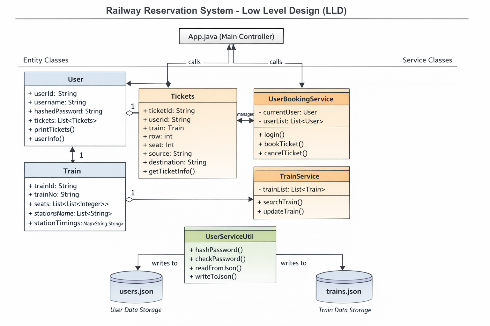

# 🚆 Railway Reservation System

The Railway Reservation System is a console-based Java application that simulates real-world train ticket booking functionality. It is built using a Service-Oriented Architecture (SOA) with clear separation between Entity, Service, and Utility layers.

The system supports secure user authentication (BCrypt), train search between stations, seat booking using a 2D seat matrix (1 = available, 0 = booked), ticket cancellation, and persistent JSON-based storage using Jackson.

This project demonstrates strong understanding of Object-Oriented Programming (OOP), Low-Level Design (LLD), clean architecture, and practical business logic implementation.

---

## 📌 Features

- User Registration & Secure Login (BCrypt)
- Search Trains Between Stations
- Seat Booking System (1 = Available, 0 = Booked)
- Ticket Cancellation (Seat Restoration)
- JSON-based Persistent Storage
- Layered Architecture (Entity → Service → Utility)

---

## 🛠 Tech Stack

- Java
- Gradle
- Jackson (JSON Mapping)
- BCrypt (Password Hashing)
- UUID (Unique ID Generation)
- File-based JSON Storage

---

## 📊 UML & Design Diagrams

### 🔹 Low Level Design (Class Diagram)

### 🔹 Use Case Diagram

### 🔹 Sequence Diagram – Book Ticket Flow

---

## 🚀 Future Improvements

- Convert to REST API (Spring Boot)
- Replace JSON with Database
- Add Admin Module
- Add Logging Framework

---

